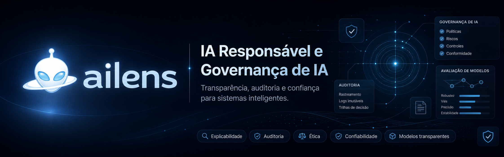

# ailens — Laboratório Aberto de IA Responsável e Governança de IA

`ailens` é um repositório brasileiro de código aberto para estudar, documentar, experimentar e aplicar IA Responsável e Governança de IA em cenários reais. O projeto reúne notas, estudos de caso, checklists, modelos de documentação, experimentos e guias práticos sobre fairness, explainability, segurança em IA, compliance em IA, transparência, auditoria de IA e uso responsável de sistemas com IA.

O valor central do projeto é transformar princípios amplos em materiais práticos: perguntas de revisão, estruturas de documentação, trilhas de estudo e critérios técnicos que ajudem equipes a discutir risco, evidência e responsabilidade com mais precisão.


## Por que este repositório existe

A adoção de IA cresce mais rápido do que a capacidade de muitas equipes documentarem riscos, limitações, decisões e responsabilidades. Modelos e aplicações chegam a produtos, processos internos e decisões sensíveis sem que fairness, transparência, auditabilidade, segurança e governança recebam a mesma atenção dada à entrega técnica.

No Brasil, ainda há espaço para materiais práticos, organizados e em português sobre Governança de IA aplicada: como avaliar riscos, documentar modelos, estruturar processos, testar vieses, revisar prompts, registrar evidências e manter responsabilidade humana sobre decisões automatizadas.

O `ailens` existe para organizar esse conhecimento de forma acessível e rigorosa. A proposta é construir um laboratório aberto, incremental e colaborativo, capaz de apoiar estudantes, profissionais, times técnicos e áreas de governança que precisam transformar princípios de IA Responsável em práticas verificáveis.

## O que você vai encontrar aqui

- Fundamentos de IA Responsável.
- Governança de IA aplicada ao ciclo de vida de sistemas.
- Estudos de caso e cenários práticos.
- Experimentos reproduzíveis sobre avaliação de modelos.
- Fairness, vieses e métricas de avaliação.
- Explainability, interpretabilidade e transparência.
- Segurança, riscos e red teaming em IA generativa.
- Compliance em IA, evidências e documentação.
- Auditoria de IA: modelos, prompts, dados e decisões.
- Modelos, checklists e matrizes de risco.
- Referências e leituras recomendadas, sempre com cautela contra desinformação.

## Estrutura do repositório

```text
.
├── BannerREADME.png
├── CODE_OF_CONDUCT.md
├── CONTRIBUTING.md
├── LICENSE
├── README.md
├── .gitignore
├── checklists/
│   ├── README.md
│   └── checklist-ia-responsavel.md
├── docs/
│   ├── README.md
│   ├── licenca.md
│   ├── auditoria/
│   │   └── README.md
│   ├── compliance/
│   │   └── README.md
│   ├── fundamentos/
│   │   └── README.md
│   ├── governanca/
│   │   └── README.md
│   └── seguranca/
│       └── README.md
├── experiments/
│   ├── README.md
│   ├── avaliacao-de-risco/
│   │   └── README.md
│   ├── explainability/
│   │   └── README.md
│   ├── fairness/
│   │   └── README.md
│   └── red-teaming/
│       └── README.md
├── governance/
│   ├── README.md
│   ├── matrizes-de-risco/
│   │   └── README.md
│   ├── politicas/
│   │   └── README.md
│   └── processos/
│       └── README.md
├── resources/
│   └── README.md
├── studies/
│   ├── README.md
│   ├── casos-reais/
│   │   └── README.md
│   └── cenarios-aplicados/
│       └── README.md
├── templates/
│   ├── README.md
│   ├── matriz-risco-ia.md
│   └── model-card.md
```

## Trilhas de estudo

| Trilha | Objetivo | Conteúdo recomendado | Resultado esperado |
| --- | --- | --- | --- |
| Fundamentos de IA Responsável | Entender conceitos centrais, limites e responsabilidades. | `docs/fundamentos/` e checklist inicial. | Vocabulário comum para discutir riscos, impactos e documentação. |
| Governança e documentação | Aprender a estruturar processos e evidências ao longo do ciclo de vida. | `docs/governanca/`, `governance/` e `templates/model-card.md`. | Capacidade de desenhar um fluxo mínimo de governança para um sistema com IA. |
| Fairness, vieses e avaliação | Identificar onde vieses podem surgir e como avaliá-los com método. | `experiments/fairness/` e `checklists/checklist-ia-responsavel.md`. | Plano inicial para avaliar impactos desiguais e limitações de dados/modelos. |
| Explainability e transparência | Diferenciar explicabilidade local, global e comunicação para públicos distintos. | `docs/fundamentos/`, `experiments/explainability/` e model cards. | Critérios para explicar decisões e comunicar limitações de forma honesta. |
| Segurança, red teaming e riscos | Mapear riscos de IA generativa, prompts, vazamento de dados e abuso. | `docs/seguranca/` e `experiments/red-teaming/`. | Roteiro de testes adversariais e controles básicos de segurança. |
| Auditoria e compliance em IA | Preparar evidências, rastreabilidade e revisão contínua sem substituir assessoria especializada. | `docs/auditoria/`, `docs/compliance/` e matrizes de risco. | Visão prática do que registrar, revisar e monitorar em sistemas com IA. |

## Áreas de pesquisa e experimentação

O laboratório será organizado em frentes técnicas que permitam estudo progressivo e experimentação responsável:

- Avaliação de vieses em dados, modelos e fluxos de decisão.
- Métricas de fairness e análise de impacto entre grupos.
- Explicabilidade local e global para modelos preditivos e aplicações com LLMs.
- Model cards como documentação mínima de propósito, uso, métricas, riscos e limitações.
- Fichas de dados, também chamadas de datasheets for datasets, para registrar origem, escopo, qualidade e restrições de dados.
- Avaliação de riscos em LLMs, incluindo alucinação, vazamento de dados e respostas inseguras.
- Governança de aplicações com IA generativa em produtos, processos e atendimento.
- RAG responsável, com atenção a fontes, recuperação, rastreabilidade e atualização de conteúdo.
- Segurança de prompts, prompt injection, jailbreaks e abuso de ferramentas conectadas.
- Monitoramento pós-deploy, drift, incidentes, métricas de qualidade e revisão humana.
- Auditoria e rastreabilidade de dados, prompts, decisões, logs e mudanças de versão.

## Casos de uso práticos

Os estudos de caso serão tratados como materiais de análise e aprendizagem. Quando um caso ainda não tiver experimento reproduzível, ele será descrito como cenário de estudo, não como resultado concluído.

- IA em recrutamento, triagem de currículos e apoio a entrevistas.
- IA em crédito, risco financeiro e priorização de atendimento.
- IA em educação, tutoria, correção e personalização de conteúdo.
- IA em atendimento ao cliente, chatbots e classificação de chamados.
- IA generativa em empresas, com documentos internos, automação e copilotos.
- Sistemas de recomendação em conteúdo, comércio e serviços digitais.
- Detecção de fraude e classificação de comportamento anômalo.
- Classificação automatizada de documentos, tickets, contratos e registros operacionais.

## Princípios do ailens

- Clareza antes de complexidade.
- Documentação como parte da governança, não como tarefa final.
- Avaliação contínua, não pontual.
- Transparência proporcional ao risco.
- Segurança e privacidade desde o início.
- Inclusão, acessibilidade e impacto social como critérios técnicos.
- Responsabilidade humana sobre decisões automatizadas.
- Evidências verificáveis acima de afirmações vagas.
- Cuidado com exageros, promessas absolutas e conclusões sem base.

## Como contribuir

Contribuições são bem-vindas quando ajudam o repositório a ficar mais claro, útil, verificável e responsável. Você pode contribuir ao:

- Corrigir textos, exemplos e inconsistências.
- Adicionar estudos de caso bem delimitados.
- Propor experimentos reproduzíveis.
- Traduzir conceitos complexos para português claro.
- Criar checklists, matrizes e modelos de documentação.
- Revisar referências quando elas forem adicionadas.
- Melhorar modelos existentes com critérios objetivos.
- Abrir issues com sugestões, dúvidas, problemas ou lacunas.

Leia o [guia de contribuição](./CONTRIBUTING.md) antes de enviar mudanças.

## Roadmap

| Versão | Foco |
| --- | --- |
| v1.0 | Base editorial, estrutura do laboratório, README, governança inicial e modelos fundamentais. |
| v1.1 | Primeiros estudos de caso documentados com escopo, riscos e perguntas de análise. |
| v1.2 | Modelos de governança, auditoria, model cards e matrizes de risco mais completos. |
| v1.3 | Experimentos práticos de fairness e explainability com execução reproduzível. |
| v1.4 | Guias de segurança e red teaming para aplicações com IA generativa. |
| v2.0 | Laboratório prático completo com notebooks, datasets de exemplo e avaliações reproduzíveis. |

## Público-alvo

- Estudantes de IA, dados, cloud e tecnologia.
- Profissionais de dados, machine learning e engenharia de software.
- Pessoas que integram IA em produtos, serviços e processos internos.
- Times de governança, risco, segurança, privacidade e compliance.
- Lideranças técnicas e de produto que precisam avaliar trade-offs de IA.
- Pessoas interessadas em IA Responsável, ética em IA e Governança de IA no Brasil.

## Aviso importante

Este repositório tem finalidade educacional e prática. Ele não substitui consultoria jurídica, regulatória, de segurança, privacidade ou compliance.

Decisões sensíveis que afetem pessoas exigem revisão humana, contexto, documentação, avaliação especializada e mecanismos de contestação. Materiais deste projeto devem ser usados como apoio para reflexão, análise técnica e melhoria de processos, não como autorização automática para implantar sistemas de alto risco.

## Licença

O projeto está licenciado sob a MIT License. Consulte o arquivo [LICENSE](./LICENSE) para ver os termos oficiais. Para uma explicação em português, consulte [docs/licenca.md](./docs/licenca.md).

## Construindo uma referência brasileira

O `ailens` começa como uma base aberta e ambiciosa para fortalecer a prática de IA Responsável e Governança de IA no Brasil. Se este trabalho for útil, considere marcar o repositório com uma estrela, abrir issues, propor melhorias e contribuir com materiais que ajudem a tornar sistemas de IA mais transparentes, seguros, auditáveis e responsáveis.
